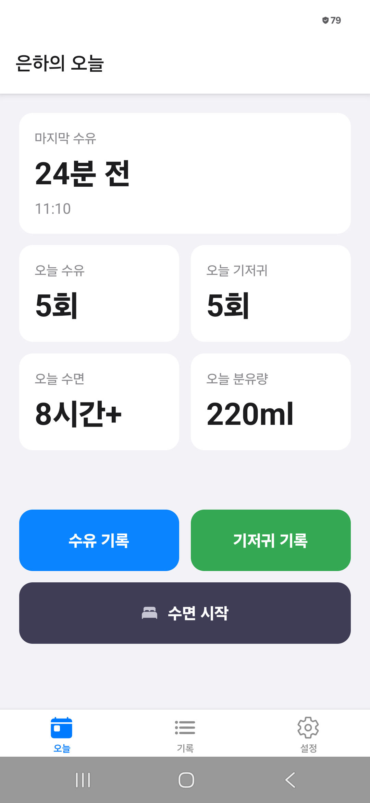
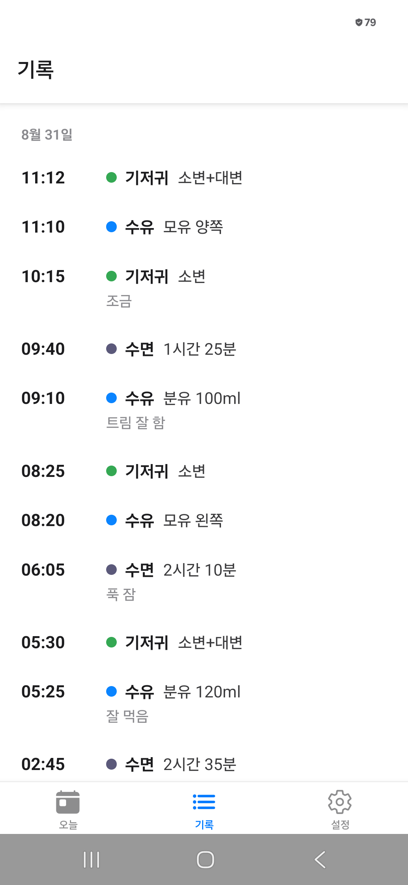
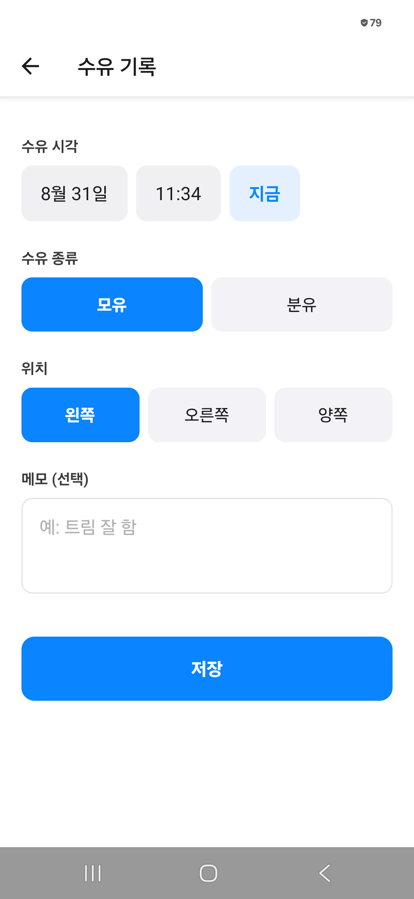
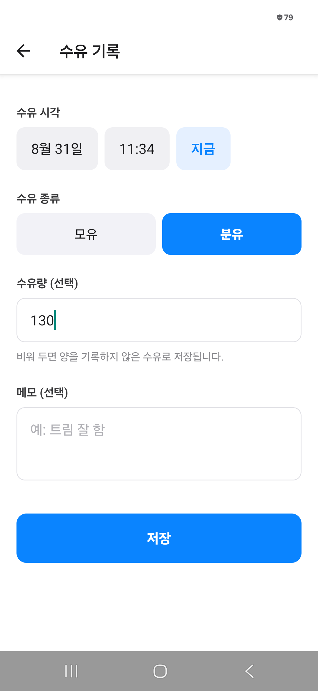

# 안녕아가

육아 중 한 손으로 빠르게 수유·기저귀·수면을 기록하는 Android 앱.
자체 계정이나 서버 없이 동작하며, 기록은 기기 SQLite에 저장한다.

**현재 상태:** Android V1 기능 완성, Google Play 출시 준비 중.

| 오늘 | 기록 |
|---|---|
|  |  |

| 수유 — 모유 | 수유 — 분유 |
|---|---|
|  |  |

## 핵심 기능

- **수유** — 모유(왼쪽·오른쪽·양쪽)와 분유(수유량)를 나눠 기록
- **기저귀** — 소변·대변·소변+대변
- **수면** — 구간으로 기록. 진행 중 상태가 앱을 껐다 켜도 유지된다
- **오늘 요약** — 마지막 수유로부터 경과 시간, 오늘의 횟수·수면 시간·분유량
- 모든 기록을 수정·삭제할 수 있고, 날짜별 타임라인으로 본다

## 기술 스택

React Native 0.86 / Expo SDK 57 / TypeScript / Expo Router / expo-sqlite

## 주요 설계 판단

**백엔드를 두지 않았다.** 육아 기록은 한 집에서 쓰는 데이터이고, 계정과 서버를
붙이면 로그인·동기화 충돌·개인정보 처리가 따라온다. V1은 기기 SQLite만 쓴다.

다만 **Android 시스템 자동 백업은 허용한다.** 앱 자체에는 내보내기나 동기화
기능이 없어서, 자동 백업이나 기기 간 전송이 동작하지 않는 환경에서는 기기를
바꿀 때 기록을 복구할 수 없다. 그래서 "기기에만 저장된다"고 안내하지 않는다 —
앱이 어디로도 보내지 않는 것과, 시스템이 백업하지 않는 것은 다른 이야기다.

**스키마를 버전으로 관리한다.** `PRAGMA user_version`을 기준으로 `0 → 5`까지
단계별 마이그레이션을 돌린다. 기능을 더할 때마다 기존 기록을 잃지 않고 스키마를
바꿔 왔고, 수유를 모유·분유로 나눌 때는 테이블을 다시 만들면서 모든 열과 인덱스를
보존하는 것을 실기기 DB에서 대조해 확인했다.

**"입력하지 않음"과 "0"을 구분한다.** 수유량을 비워 두면 `0`이 아니라 `NULL`로
저장한다. `0ml` 기록은 `마지막 수유` 시각을 갱신해 이 앱에서 가장 중요한 숫자를
오염시킨다. 같은 이유로 오늘 분유량이 하나도 없으면 `0ml`이 아니라 `기록 없음`을
보여준다.

**수유 종류별로 유효한 입력 조합을 제한한다.** V1의 직접 모유 수유는 위치를
기록하고 양이 없으며, 분유는 위치가 없고 양을 선택으로 기록한다. 유축은 V1
범위에서 제외했다. 서로의 열은 `NULL`이어야 한다는 규칙을 DB `CHECK`로 강제하고,
입력 타입은 판별 유니온으로 두어 잘못된 조합이 컴파일 단계에서 걸리게 했다.
그래서 `오늘 분유량`은 분유만 더한다.

**수면은 날짜 경계에서 잘라 센다.** 전날 23시에 시작해 오늘 02시에 끝난 수면은
오늘 합계에 2시간만 들어간다. 겹치는 기록은 합집합으로 병합해 하루에 나올 수 없는
합계가 생기지 않게 했다. 하루의 끝을 `시작 + 86400000`으로 계산하지 않는다 —
서머타임이 있는 지역에서 깨진다.

**진행 중인 수면은 하나뿐이다.** 부분 유니크 인덱스로 DB가 강제하고, 종료는
`ended_at IS NULL` 조건이 붙은 UPDATE라 연타해도 시각이 덮이지 않는다.

## 테스트와 검증

- 순수 로직에 대한 단위 테스트 34개 (jest / jest-expo) — 날짜 경계, 수면 구간
  병합, 수유량 파싱, 시간 포맷
- TypeScript strict, ESLint(React Compiler 규칙 포함)
- Android 실기기(Galaxy) 회귀 — 추가·수정·삭제, 자정 경계 집계, 진행 중 수면의
  앱 재시작·백그라운드 복귀, 마이그레이션 전후 데이터 보존
- 릴리스 빌드(`preview` APK)에서 Metro 없이 최종 확인

## 실행 방법

```bash
npm install
npx expo start --go
```

`expo-dev-client`가 설치돼 있어 `--go` 없이 실행하면 개발 빌드를 찾는다.
자체 패키지 환경에서 확인하려면 개발 빌드를 만든다.

```bash
eas build --platform android --profile development
# 만들어진 APK를 기기에 설치한 뒤
npx expo start --dev-client
```

## 범위

V1은 Android 전용이다. 저장소와 패키지 식별자는 개발 초기 이름인 `carelog`를
그대로 쓴다 — 표시 이름만 `안녕아가`로 정했고, 기존 Expo 프로젝트와 빌드 이력을
유지하기 위해 바꾸지 않았다.

V1.1 이후로 미룬 것: 일령 표시, 통계 화면과 추이 그래프, 백업·가져오기,
수동 다크모드, 수유 타이머, 유축, 알림, 여러 아이, 클라우드 동기화.

단계별 계획과 결정의 근거는 [docs/PLAN.md](docs/PLAN.md)에 있다.
Play 스토어 링크는 출시 후에 넣는다.
